# Driven by Deno + react and escorted by Vercel, build personal blog at top speed

> In Chinese Kung Fu, 'in the world of kung fu speed determines the winner'. In the world of programming, how to quickly build a blog of your own? Then pagic + versel should be a good choice!

## Pagic

[Pagic](https://github.com/xcatliu/pagic) It is a static website generator driven by DeNO + react. It has simple configuration, supports rendering MD / TSX files into static pages, and has a large number of official or third-party themes and plug-ins to extend, which means that you can freely develop and customize your favorite theme style or function plug-ins. What are the advantages of pagic over other static website generators?


|                       | Pagic | VuePress | Hexo | Jekyll | Hugo |
| --------------------- | ----- | -------- | ---- | ------ | ---- |
| Support `md`          | ✓     | ✓        | ✓    | ✓      | ✓    |
| React/Vue             | ✓     | ✓        |      |        |      |
| SPA                   | ✓     | ✓        |      |        |      |
| Allow `tsx` in config | ✓     |          |      |        |      |
| ...                   |       |          |      |        |      |

Pagic stands on the shoulders of giants and refers to the config options and documents of some other static site generators. Hereby, [Pagic](https://github.com/xcatliu/pagic)  would like to express her sincere thanks to these open source projects and communities.

How to use such a good pagic?

First, install [Deno](https://github.com/denoland/deno):

```
# Shell (Mac, Linux):
curl -fsSL https://deno.land/x/install/install.sh | sh
```

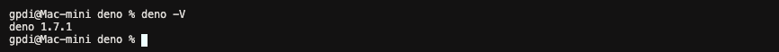


Then, install the latest version of [Pagic](https://github.com/xcatliu/pagic)  :

```
deno install --unstable --allow-read --allow-write --allow-net --allow-run --name=pagic https://deno.land/x/pagic/mod.ts
```
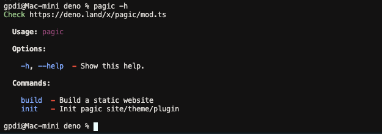


Initialize the [Pagic](https://github.com/xcatliu/pagic) project :

```
mkdir site && cd site && echo "export default {};" > pagic.config.ts && echo "# Hello world" > README.md
```

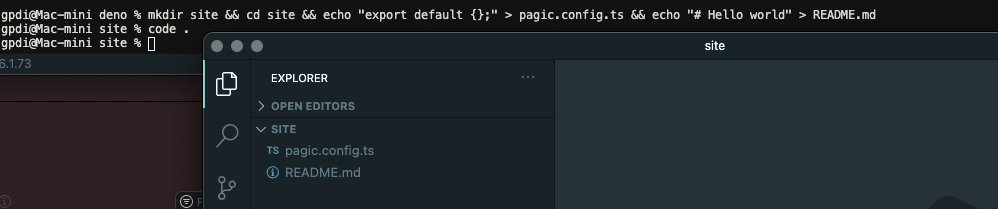


Run pagic build: 

```
pagic build --watch --serve
```

Now you can see the page of **Hello world** by visiting `127.0.0.1:8000`：

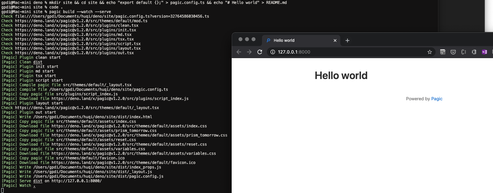


## Vercel

[Vercel](https://vercel.com/) is a cloud platform for static sites and serverless functions, which fully conforms to your workflow. It enables developers to host websites and web services, which can be deployed instantly, expanded automatically, and without any supervision, all of which do not need to be configured.

Deploy to [Versel](https://vercel.com/）We need to create a file like `deploy-vercel.sh`:
```
!/bin/sh

# Install deno
curl -fsSL https://deno.land/x/install/install.sh | sh

# Install pagic
/vercel/.deno/bin/deno install --unstable --allow-read --allow-write --allow-net https://deno.land/x/pagic/mod.ts

# Pagic build
/vercel/.deno/bin/deno run --unstable --allow-read --allow-write --allow-net --allow-run https://deno.land/x/pagic/mod.ts build
```

Then create the `package.json` :
```
{
    "scripts": {
        "deploy:vercel": "sh deploy-vercel.sh"
    }
}
```

Vercel supports GitHub, Gitlab, Bitbucket and other login methods：

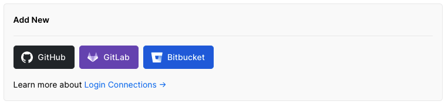

I use GitHub a lot, so I build a new repository on GitHub named `pagic_template` :

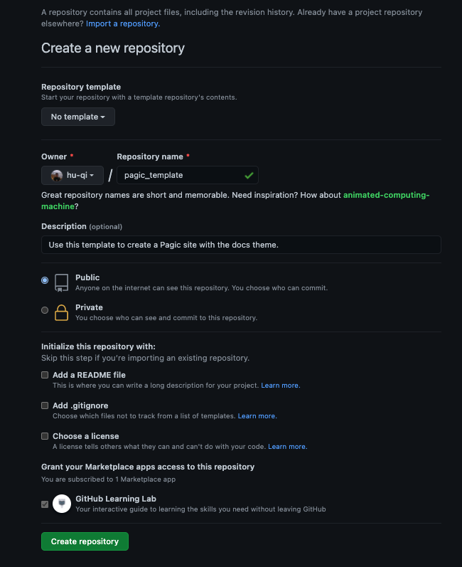


Then submit the local code to Github：
 
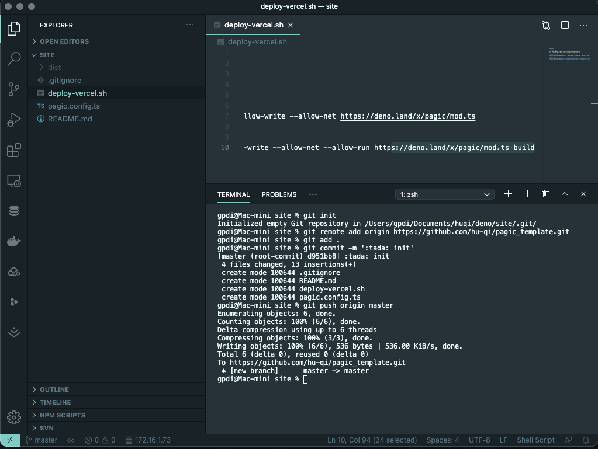

Next, complete the following steps on the [Vercel](https://vercel.com/) website:

1. On [Home](https://vercel.com/dashboard), click Import Project
2. [Fill in](https://vercel.com/import/git) warehouse address, from Github [import](https://vercel.com/import) the warehouse to be deployed, click continue
3. Configure project information

  - Fill in the project name, the framework defaults to Other
  - Packaging and output configuration, build command: `npm run deploy:vercel` Output directory: `dist` (You can also fill in according to your own configuration)

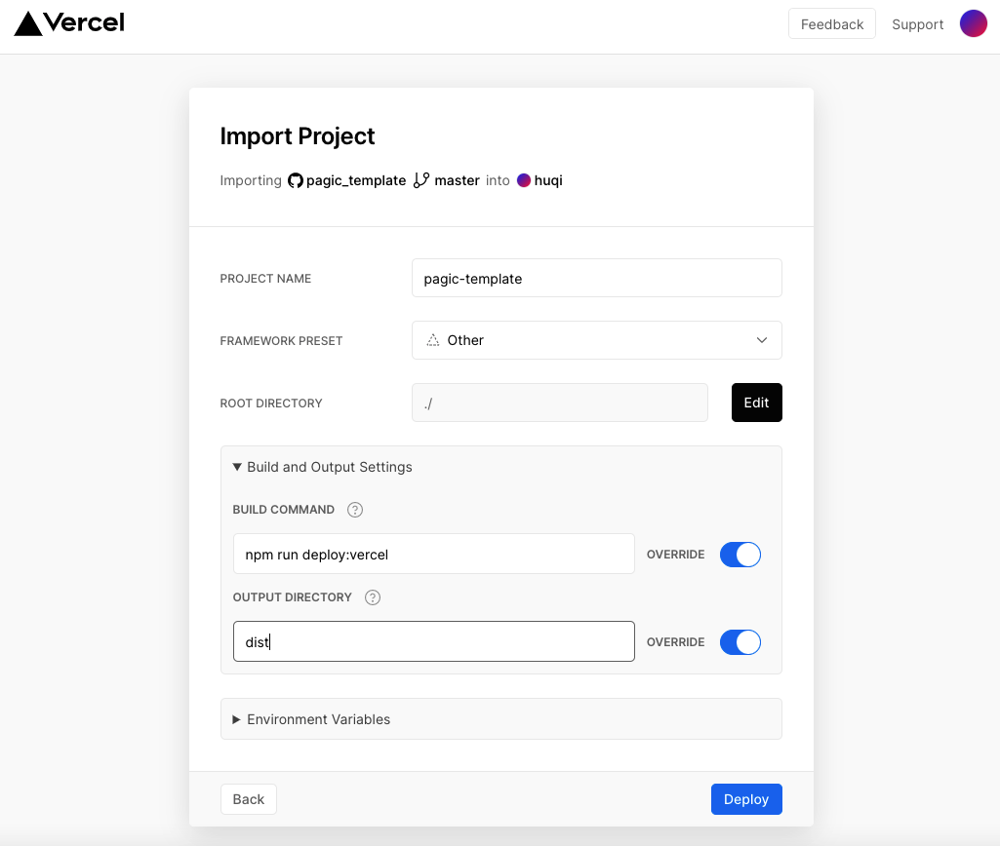

4. Click Deploy and wait for the deployment to complete to access 🎊 :


## Blog

Currently, Pagic supports three themes: Default, DOC, Blog, we try to modify the `pagic.config.ts` file to enable Pagic's blog mode:
```
export default {
    theme: 'blog',
    plugins: ['blog'],
    title: 'pagic template',
    description: 'Use this template to create a Pagic site with the blog theme.',
    github: 'https://github.com/hu-qi/pagic_template',
    blog: {
        root: '/posts/',
        social: {
          github: 'hu-qi/pagic_template',
          email: 'huqi@gpdi.com',
          twitter: 'huqii',
          v2ex: 'huqi',
          zhihu: 'fashaoge'
        }
      }
};

```
In the above code, we have configured Title, description and other parameters for the blog. Among them, social can configure our social accounts. By default, it supports Github, Email, Twitter, V2ex, Zhihu. Of course, you can also develop your own themes or plug-ins to customize What you want.
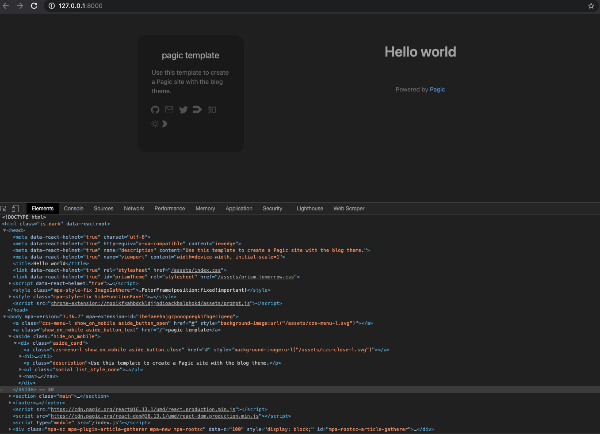

Then we started to improve the navigation, classification, tags, external links, etc. that are commonly used in blogs. At this time, we need to add some directories, such as about, archive, links, etc., for unified management, we put all these folders in the src directory Below, our directory structure is as follows:
```
site                          
├─ dist                       // output   
├─ src                        // input
│  ├─ about                   
│  │  └─ README.md            
│  ├─ archives                
│  │  └─ README.md            
│  ├─ assets                  
│  ├─ categories              
│  │  └─ README.md            
│  ├─ links                   
│  │  └─ README.md            
│  ├─ posts                   // maybe write somethings
│  ├─ tags                    
│  │  └─ README.md            
│  └─ README.md               // homepage
├─ README.md                  
├─ deploy-vercel.sh           
├─ package.json               
└─ pagic.config.ts            
```
In terms of configuration, we added nav and set srcDir to src:
```diff
export default {
+   srcDir: 'src',
+   nav: [
+       {
+         text: 'Homepage',
+         link: '/index.html',
+         icon: 'czs-home-l',
+       },
+       {
+         text: 'Categories',
+         link: '/categories/index.html',
+         icon: 'czs-category-l',
+       },
+       {
+         text: 'Tags',
+         link: '/tags/index.html',
+         icon: 'czs-tag-l',
+       },
+       {
+         text: 'About',
+         link: '/about/index.html',
+         icon: 'czs-about-l',
+       },
+       {
+         text: 'Archives',
+         link: '/archives/index.html',
+         icon: 'czs-box-l',
+       },
+       {
+         text: 'Friends',
+         link: '/links/index.html',
+         icon: 'czs-link-l',
+       },
+     ],
}
```

On the mobile side, Pagic also has a good experience:
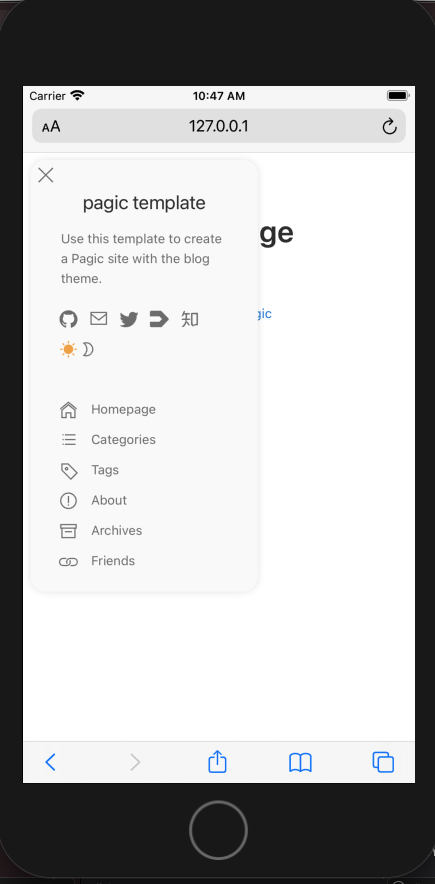

Then we write articles in the form of markdown in the posts directory. We can add some fields to the header of the .md file for classification statistics, such as:
```
---
title: Driven by DeNO + react and escorted by vercel, build personal blog at top speed
author: huqi
date: 2021/02/04
cover: 'https://assets.vercel.com/image/upload/v1595320886/front/home/globe-texture.jpg'
categories:
- Blog
tags:
- Deno
- React
- Pagic
- Vercel
---
```

After writing some articles, our blog looks very rich!


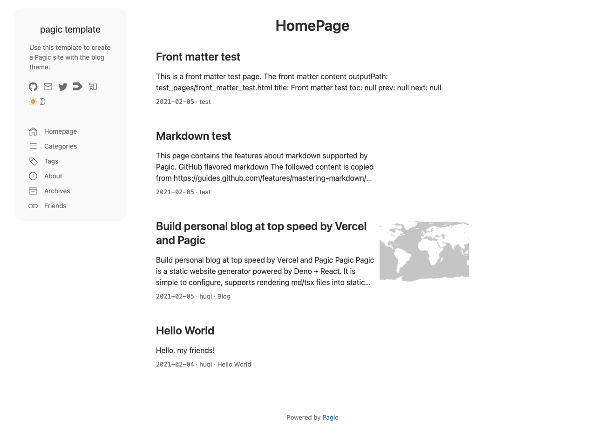

At this point, when we submit the code to the remote warehouse, it will be automatically deployed to Vercal. In the future, every time we write an article and submit it to the remote warehouse, Vercal will be able to automatically deploy updates, which is great!

Copy Code, Copy World! [https://github.com/hu-qi/pagic_template](https://github.com/hu-qi/pagic_template)